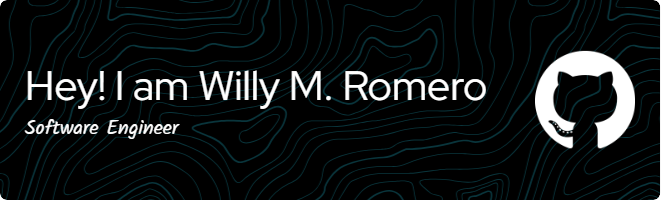

 

<!--  -->

<!--  -->

## 💫 About Me

- 🔭 I’m currently working as freelancer Software Engineer 🦾
- 🌱 I’m currently learning **Next.js**
- 👀 I’m interested in Software Engineering
- 👨‍💻 All of my projects are available at **[github/willymromero](https://github.com/willymromero)**
- 📫 How to reach me **<willymromero@gmail.com>**
- 🔗 See my web portfolio at **[willymromero](https://willymromero.vercel.app/)**
  
 

    
<!--  -->
    
<!--  -->
<!--      -->

### Languages

### Frameworks/technologies

### Tools

